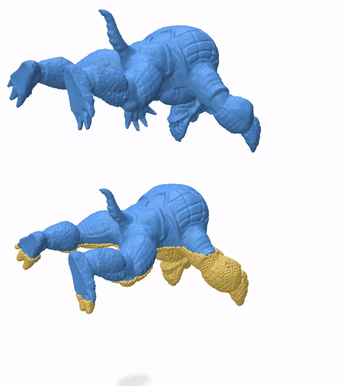
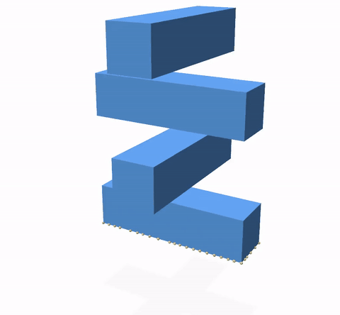

<div align="center">
  
# Physics Based Animation Toolkit

**A flexible C++20 library for physics-based simulation**


[](https://github.com/Q-Minh/PhysicsBasedAnimationToolkit/actions/workflows/pyinstall.yml)
[](https://github.com/Q-Minh/PhysicsBasedAnimationToolkit/actions/workflows/wheels.yml)
[](https://pypi.org/project/pbatoolkit/)
[](https://pypi.org/project/pbatoolkit/)
[](https://github.com/Q-Minh/PhysicsBasedAnimationToolkit/releases)
[](LICENSE)

[**Quick Start**](#-quick-start) •
[**Documentation**](#-features) •
[**Examples**](#-gallery) •
[**Installation**](#-installation) •
[**Contributing**](#-contributing)

</div>


---

## 🚧 Development Notice

> **⚠️ This library is currently under active development** 
> 
> While the core functionality is working and the library is usable, we are actively working towards a stable release with comprehensive documentation. Expect the following improvements in the coming months:
> - 📚 **Much better documentation** with detailed examples and tutorials
> - 🔧 **API stabilization** and improved user experience
>
> We appreciate your patience as we work to deliver a polished, well-documented library!

---

## 🎯 What is PBAT?

PBAT (Physics Based Animation Toolkit) is a **flexible, cross-platform C++20 library** that exposes the fundamental building blocks of physically-based simulation. Rather than hiding implementation details behind black-box APIs, PBAT gives researchers and developers direct access to core algorithms, enabling rapid prototyping of new techniques while maintaining the flexibility to customize and extend simulation frameworks.

### Why PBAT?

- 🧩 **Modular Building Blocks**: Direct access to core algorithms without abstraction layers enabling interoperability with existing ecosystem
- 🔬 **Research Expressivity**: Expose implementation details to enable novel research directions
- 🐍 **Rapid Prototyping**: Python integration for quick iteration and experimentation

## ✨ Features

<table>
<tr>
<td width="50%">

### 🧮 Finite Element Method
- **Multi-dimensional support**: 1D, 2D, 3D simulations
- **[Lagrange shape functions](https://doc.comsol.com/5.3/doc/com.comsol.help.comsol/comsol_api_xmesh.40.4.html)** of order 1-3
- **Element types**: Lines, triangles, quads, tetrahedra, hexahedra
- **[Polynomial quadrature rules](https://en.wikipedia.org/wiki/Numerical_integration)** for accurate integration

### 🔷 Geometry Processing
- **Mesh** repair, refinement, simplification, remeshing, boundary extraction, cage generation, partitioning, tetrahedralization, file format conversion
- **SDF** editing, querying and root-finding and optimization.

</td>
<td width="50%">

### 🚀 GPU Acceleration
- **[Vertex Block Descent](https://graphics.cs.utah.edu/research/projects/vbd/vbd-siggraph2024.pdf) (VBD)** for real-time dynamics
- **[eXtended Position Based Dynamics](https://mmacklin.com/xpbd.pdf) (XPBD)** solver
- **Broad-phase collision detection** with [Sweep and Prune](https://en.wikipedia.org/wiki/Sweep_and_prune)
- **[Linear BVH](https://research.nvidia.com/sites/default/files/pubs/2012-06_Maximizing-Parallelism-in/karras2012hpg_paper.pdf)** for spatial queries

### 🔍 Spatial Acceleration
- **[Bounding Volume Hierarchies](https://en.wikipedia.org/wiki/Bounding_volume_hierarchy)** (BVH)
- (Hierarchical) **Hash Grids**
- **Nearest Neighbor** search
- **Overlap** querying

</td>
</tr>
</table>

### 🔧 Additional Features
- 🐍 **Python bindings** with NumPy integration
- 📊 **[Tracy profiler](https://github.com/wolfpld/tracy)** integration for performance analysis  
- 🏗️ **Cross-platform** support (Windows, Linux, macOS)
- ⚙️ **Template-based** design for algorithmic flexibility and specialization

> _Currently, the `master` branch may contain breaking changes at any point in time. We recommend users to use specific git tags, i.e. via `git checkout v<major>.<minor>.<patch>`, where the version `<major>.<minor>.<patch>` matches the installed `pbatoolkit`'s version downloaded from PyPI (i.e. from `pip install pbatoolkit`)._

## 📋 Table of Contents

- [🎯 What is PBAT?](#-what-is-pbat)
- [✨ Features](#-features)
- [🚀 Quick Start](#-quick-start)
  - [Python Installation](#python-installation)
  - [First Steps](#first-steps)
  - [C++ Usage](#c-usage)
- [📦 Installation](#-installation)
  - [From PyPI (Recommended)](#from-pypi-recommended)
  - [Building from Source](#building-from-source)
- [🎨 Gallery](#-gallery)
- [📚 Documentation](#-documentation)
- [🛠️ Advanced Topics](#️-advanced-topics)
  - [Dependencies](#dependencies)
  - [CUDA Setup](#cuda-setup)
  - [Configuration Options](#configuration-options)
- [🤝 Contributing](#-contributing)
- [📄 License](#-license)
- [📖 Citation](#-citation)

## 🚀 Quick Start

> 💡 **Pro Tip**: Install the [Tracy profiler](https://github.com/wolfpld/tracy/releases) to analyze performance and visualize algorithm execution in real-time!

### Python

```bash
pip install pbatoolkit
```

Try this simple example to verify your installation:

```python
from pbatoolkit import pbat
import numpy as np

# Create a simple tetrahedral mesh
V = np.array([
    [0.0, 0.0, 0.0],
    [1.0, 0.0, 0.0], 
    [0.0, 1.0, 0.0],
    [0.0, 0.0, 1.0]
])
C = np.array([[0, 1, 2, 3]])

# Create a finite element mesh
element = pbat.fem.Element.Tetrahedron
order = 1
mesh = pbat.fem.mesh(V.T, C.T, element=element, order=order)

# Explore available modules
help(pbat)
```

### C++

Check out our [unit tests](https://github.com/Q-Minh/PhysicsBasedAnimationToolkit/source)!

## 📦 Installation

### From PyPI (Recommended)

The easiest way to get started is via pip:

```bash
# CPU-only version (lighter, good for getting started)
pip install pbatoolkit

# GPU-accelerated version (requires CUDA, see CUDA Setup below)
pip install pbatoolkit-gpu
```

### Building from Source

For the latest features or custom configurations:

```bash
# Clone the repository
git clone https://github.com/Q-Minh/PhysicsBasedAnimationToolkit.git
cd PhysicsBasedAnimationToolkit

# TODO: Install dependencies ...

# Build and install
pip install . --config-settings=cmake.args="--preset=pip" --config-settings=build.tool-args="-j 4" --config-settings=cmake.build-type="Release" -v
```

Refer to [scikit-build-core](https://scikit-build-core.readthedocs.io/en/stable/) and [CMake](https://cmake.org/documentation/) for more fine-grained build customization.

## 📚 Documentation

Full online documentation hosted at [q-minh.com/PhysicsBasedAnimationToolkit](https://www.q-minh.com/PhysicsBasedAnimationToolkit/).

- 📁 **[Python Demos](python/examples/)**: Ready-to-run scripts with detailed documentation
- 📖 **[Tutorials](./doc/tutorial/)**: Step-by-step guides for physics-based animation
- 🧪 **[Unit Tests](https://github.com/Q-Minh/PhysicsBasedAnimationToolkit/source)**: Check out unit tests in source files for C++ usage patterns

### Running Examples

```bash
# Install example dependencies
pip install -r python/examples/requirements.txt

# Display help menu of one of the examples
python -m python.examples.vbd -h

# See all available examples
ls python/examples/
```

### Mesh Resources

Need test meshes? Here are some great sources:
- 🔺 **[Thingi10K](https://ten-thousand-models.appspot.com/)**: Large collection of 3D models
- 🎨 **[TurboSquid Free](https://www.turbosquid.com/Search/3D-Models/free)**: High-quality free models  
- 🛠️ **[Blender](https://www.blender.org/)**: Create your own meshes

Convert surface meshes to volumes using:
- **[TetWild](https://github.com/Yixin-Hu/TetWild)**: Robust tetrahedral meshing
- **[fTetWild](https://github.com/wildmeshing/fTetWild)**: Fast TetWild variant
- **[TetGen](https://wias-berlin.de/software/index.jsp?id=TetGen&lang=1)**: Classic tetrahedral mesh generator

## 🛠️ Advanced Topics

### Dependencies

See [`vcpkg.json`](./vcpkg.json) for a complete list of external dependencies. We recommend using [vcpkg](https://github.com/microsoft/vcpkg) for dependency management, though any dependency discoverable by CMake's [`find_package`](https://cmake.org/cmake/help/latest/command/find_package.html) will work.

### CUDA Setup

#### For PyPI Installation

[`pbatoolkit-gpu`](https://pypi.org/project/pbatoolkit-gpu/) (downloaded from PyPI) requires dynamically linking to an instance of the
- [CUDA 12 Runtime library](https://docs.nvidia.com/cuda/cuda-c-programming-guide/index.html#cuda-runtime), and your
- [CUDA Driver](https://docs.nvidia.com/cuda/cuda-c-programming-guide/#driver-api). 

> Recall that the CUDA Runtime is [ABI compatible](https://docs.nvidia.com/cuda/archive/12.5.1/cuda-driver-api/version-mixing-rules.html) up to major version.

On 64-bit Windows, these are `cudart64_12.dll` and `nvcuda.dll`. Ensure that they are discoverable via Windows' [DLL search order](https://learn.microsoft.com/en-us/windows/win32/dlls/dynamic-link-library-search-order). We recommend adding `<drive>:\Program Files\NVIDIA GPU Computing Toolkit\CUDA\v12.<minor>\bin` (i.e. the binary folder of your CUDA Toolkit installation) to the `PATH` environment variable. The driver should already be on the search path by default after installation.

On Linux, they are `libcudart.so.12` and `libcuda.so.1`. Ensure that they are discoverable via Linux's [dynamic linker/loader](https://man7.org/linux/man-pages/man8/ld.so.8.html). If they are not already in a default search path, we recommend simply updating the library search path, i.e. `export LD_LIBRARY_PATH="path/to/driver/folder;path/to/runtime/folder;$LD_LIBRARY_PATH"`.

> MacOS does not support CUDA GPUs.

Our [`pbatoolkit-gpu`](https://pypi.org/project/pbatoolkit/) prebuilt binaries include [PTX](https://docs.nvidia.com/cuda/cuda-compiler-driver-nvcc/#virtual-architectures), such that program load times will be delayed by [JIT](https://docs.nvidia.com/cuda/cuda-c-programming-guide/index.html#just-in-time-compilation) compilation on first use. [Verify](https://developer.nvidia.com/cuda-gpus) that your NVIDIA GPU supports [compute capability](https://docs.nvidia.com/cuda/cuda-c-programming-guide/index.html#compute-capabilities) at least 7.0. For example, only RTX 2060 up to 4090 chips are supported in the GeForce series. Runtime GPU performance may be constrained by the targeted compute capability.

#### Local

> 💡 **Pro Tip**: Familiarize yourself with the [CMake documentation](https://cmake.org/cmake/help/latest/) before building from source, especially if you're new to CMake!

Consider [locally building and installing](#build--install) `pbatoolkit` against your native GPU for the following reasons.
- Achieve optimal GPU performance for your platform.
- Support older/newer GPUs and CUDA Toolkit versions.

## Configuration

| Option                       | Values   | Default | Description |
| ---------------------------- | -------- | ------- | ----------- |
| `PBAT_BUILD_PYTHON_BINDINGS` | `ON,OFF` | `OFF`   | Enable `PhysicsBasedAnimationToolkit_PhysicsBasedAnimationToolkit` Python bindings. Generates the CMake target `PhysicsBasedAnimationToolkit_Python`, an extension module for Python, built by this project. |
| `PBAT_BUILD_TESTS`           | `ON,OFF` | `OFF`   | Enable `PhysicsBasedAnimationToolkit_PhysicsBasedAnimationToolkit` unit tests. Generates the CMake target executable `PhysicsBasedAnimationToolkit_Tests`, built by this project. |
| `PBAT_ENABLE_PROFILER`       | `ON,OFF` | `OFF`   | Enable [`Tracy`](https://github.com/wolfpld/tracy) instrumentation profiling in built `PhysicsBasedAnimationToolkit_PhysicsBasedAnimationToolkit`. |
| `PBAT_PROFILE_ON_DEMAND`     | `ON,OFF` | `OFF`   | Activate Tracy's on-demand profiling when `PBAT_ENABLE_PROFILER` is `ON`. |
| `PBAT_USE_SUITESPARSE`       | `ON,OFF` | `OFF`   | Link to user-provided [SuiteSparse](https://github.com/DrTimothyAldenDavis/SuiteSparse) installation via CMake's [`find_package`](https://cmake.org/cmake/help/latest/command/find_package.html). |
| `PBAT_BUILD_SHARED_LIBS`     | `ON,OFF` | `OFF`   | Build project's library targets as shared/dynamic. |
| `PBAT_USE_CUDA`     | `ON,OFF` | `OFF`   | Link to CUDA Toolkit for GPU API. |
| `PBAT_BUILD_DOC`     | `ON,OFF` | `OFF`   | Build project's doxygen documentation. |

Our project provides [configuration presets](./CMakePresets.json) that capture typical use configurations. For the best experience, install [`vcpkg`](https://github.com/microsoft/vcpkg) and set `VCPKG_ROOT=path/to/vcpkg` as an environment variable. Then, you can select one of our available presets, for example `cmake --preset=default`. Refer to the [CMake presets documentation](https://cmake.org/cmake/help/latest/manual/cmake-presets.7.html) for more information.

## Build & Install

### C++

Refer to the corresponding CMake [build](https://cmake.org/cmake/help/latest/manual/cmake.1.html#build-a-project) and [install](https://cmake.org/cmake/help/latest/manual/cmake.1.html#install-a-project) workflows. We recommend writing a customized [`CMakeUserPresets.json`](https://cmake.org/cmake/help/latest/manual/cmake-presets.7.html#introduction) for your development environment.

| Target | Description |
|---|---|
| `PhysicsBasedAnimationToolkit_PhysicsBasedAnimationToolkit` | The PBA Toolkit library. |
| `PhysicsBasedAnimationToolkit_Tests` | The test executable, using [doctest](https://github.com/doctest/doctest). |
| `PhysicsBasedAnimationToolkit_Python` | PBAT's Python extension module, using [nanobind](https://github.com/wjakob/nanobind). |
| `PhysicsBasedAnimationToolkit_Docs` | Documentation. |

### Python

For a local installation, which builds from source, our Python bindings build relies on [scikit-build-core](https://scikit-build-core.readthedocs.io/en/latest/index.html), which in turn relies on CMake's [`install`](https://cmake.org/cmake/help/latest/command/install.html) mechanism. As such, you can configure the installation as you typically would when using the CMake CLI directly, by now passing the corresponding CMake arguments in `pip`'s `config-settings` parameter (refer to the [scikit-build-core](https://scikit-build-core.readthedocs.io/en/latest/index.html) documentation for the relevant parameters). See our [pyinstall workflow](.github/workflows/pyinstall.yml) for working examples of building from source on Linux, MacOS and Windows. Then, assuming that external dependencies are found via CMake's [`find_package`](https://cmake.org/cmake/help/latest/command/find_package.html), you can build and install our Python package [`pbatoolkit`](https://pypi.org/project/pbatoolkit/) locally and get the most up to date features. 

> 💡 **Pro Tip**: Consider using a [Python virtual environment](https://docs.python.org/3/library/venv.html) for this step.

As an example, assuming use of [`vcpkg`](https://github.com/microsoft/vcpkg) for external dependency management with `VCPKG_ROOT=path/to/vcpkg` set as an environment variable, run

```bash
pip install . --config-settings=cmake.args="--preset=pip-cuda" -v
```

on the command line to build [`pbatoolkit`](https://pypi.org/project/pbatoolkit/) from source with GPU algorithms included. Additional environment variables (i.e. [`CUDA_PATH`](https://cmake.org/cmake/help/latest/module/FindCUDAToolkit.html)) and/or CMake variables (i.e. [`CMAKE_CUDA_COMPILER`](https://cmake.org/cmake/help/latest/variable/CMAKE_LANG_COMPILER.html#variable:CMAKE_%3CLANG%3E_COMPILER)) may be required to be set in order for CMake to correctly discover and compile against your targeted local CUDA installation. Refer to [the CMake documentation](https://cmake.org/cmake/help/latest/module/FindCUDAToolkit.html) for more details.

## 🎨 Gallery

See PBAT in action! These examples showcase what's possible with just a few lines of code. Full source code available in [`python/examples/`](./python/examples/).

##### Real-time hyper elasticity dynamics

Our GPU implementation of the eXtended Position Based Dynamics (XPBD) algorithm simulates a ~324k element FEM elastic mesh interactively with contact.

<p float="left">
    
</p>

##### Inter-penetration free elastodynamic contact

Combining [`pbatoolkit`](https://pypi.org/project/pbatoolkit/)'s FEM+elasticity features and the [`IPC Toolkit`](https://ipctk.xyz/) results in guaranteed inter-penetration free contact dynamics between deformable bodies.

<p float="left">
    
</p>

##### Modal analysis

The hyper elastic beam's representative deformation modes, i.e. its low frequency eigen vectors,
are animated as time continuous signals.

<p float="left">
    
</p>

##### GPU broad phase collision detection

Real-time collision detection between 2 large scale meshes (~324k tetrahedra) is accelerated by highly parallel implementations of the [sweep and prune](https://en.wikipedia.org/wiki/Sweep_and_prune) algorithm, or [linear bounding volume hierarchies](https://research.nvidia.com/sites/default/files/pubs/2012-06_Maximizing-Parallelism-in/karras2012hpg_paper.pdf).

<p float="left">
    
</p>

##### Harmonic interpolation

A smooth (harmonic) function is constructed on [Entei](<https://bulbapedia.bulbagarden.net/wiki/Entei_(Pok%C3%A9mon)>), required to evaluate to `1` on its paws, and `0` at the top of its tail, using piece-wise linear (left) and quadratic (right) shape functions. Its isolines are displayed as black curves.

<p float="left">
  
   
</p>

##### Heat method for geodesic distance computation

Approximate geodesic distances are computed from the top center vertex of [Metagross](<https://bulbapedia.bulbagarden.net/wiki/Metagross_(Pok%C3%A9mon)>) by diffusing heat from it (left), and recovering a function whose gradient matches the normalized heat's negative gradient. Its isolines are displayed as black curves.

<p float="left">
  
   
</p>

##### Mesh smoothing via diffusion

Fine details of Godzilla's skin are smoothed out by diffusing `x,y,z` coordinates in time.

<p float="left">
    
</p>

##### Profiling statistics

Computation details are gathered when using [`pbatoolkit`](https://pypi.org/project/pbatoolkit/) and consulted in the [Tracy](https://github.com/wolfpld/tracy) profiling server GUI.

<p float="left">
    
</p>

## 🤝 Contributing

We welcome contributions from the community! Here's how you can help:

### 🐛 Reporting Issues
- Use our [issue tracker](https://github.com/Q-Minh/PhysicsBasedAnimationToolkit/issues) to report bugs
- Include detailed reproduction steps and system information
- Check existing issues to avoid duplicates

### 💻 Code Contributions
1. **Fork** the repository
2. **Create** a feature branch (`git checkout -b feature/amazing-feature`)
3. **Follow** our coding standards (see below)
4. **Add tests** for new functionality
5. **Commit** your changes (`git commit -m 'Add amazing feature'`)
6. **Push** to your branch (`git push origin feature/amazing-feature`)
7. **Open** a Pull Request

### 📝 Coding Standards
- We use **clang-format** for consistent code styling
- Configuration provided in `.clang-format` at repository root
- Run `clang-format` before committing (VS Code/Visual Studio have built-in support)
- Follow modern C++20 best practices
- Add comprehensive tests for new features

### 🏗️ Development Setup
```bash
# Clone your fork
git clone https://github.com/YOUR_USERNAME/PhysicsBasedAnimationToolkit.git
cd PhysicsBasedAnimationToolkit

# Set up dependencies (requires vcpkg)
export VCPKG_ROOT=/path/to/vcpkg

# Build with tests enabled
cmake --preset=dev --log-level=verbose
cmake --build build --target PhysicsBasedAnimationToolkit_Tests
```

## 📄 License

This project is licensed under the **MIT License** - see the [LICENSE](LICENSE) file for details.

## 📖 Citation

If you use PBAT in your research, please cite:

```bibtex
@software{pbat2024,
  title={Physics Based Animation Toolkit},
  author={Ton-That, Quoc-Minh},
  url={https://github.com/Q-Minh/PhysicsBasedAnimationToolkit},
  version={0.0.1},
  year={2024}
}
```

---

<div align="center">

[🌟 Star us on GitHub](https://github.com/Q-Minh/PhysicsBasedAnimationToolkit) • 
[🐛 Report Issues](https://github.com/Q-Minh/PhysicsBasedAnimationToolkit/issues) • 
[💬 Discussions](https://github.com/Q-Minh/PhysicsBasedAnimationToolkit/discussions)

</div>
