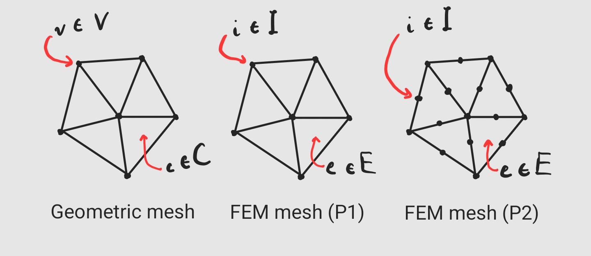
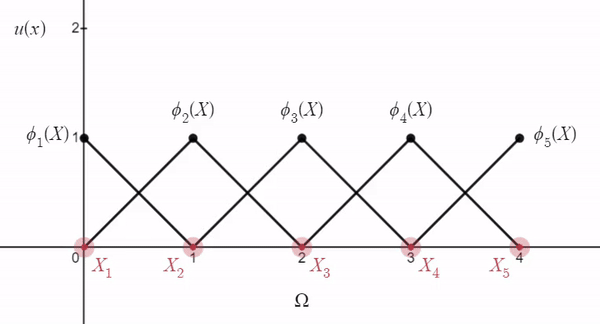
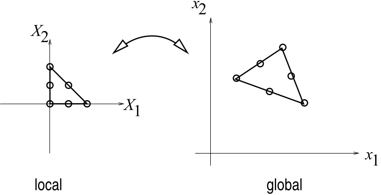
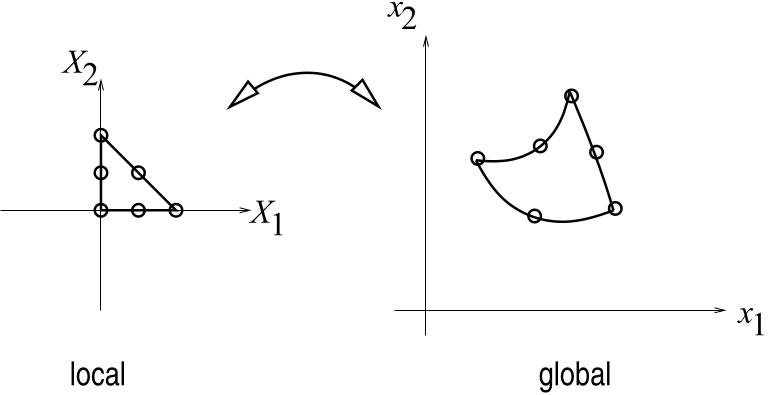

The Finite Element Method
=========================

Introduction
------------

The Finite Element Method (FEM) is an approach to discretizing space-dependent continuous problems defined on geometrically "complex" domains. As opposed to Finite Differences (FD), which is restricted to regular grid domains, FEM relies on `meshing <https://en.wikipedia.org/wiki/Mesh_generation>`_ the problem's domain (geometric discretization), describing the problem's solution as a linear combination of piece-wise (i.e. per mesh element) interpolating polynomials (functional discretization), and solving the approximated problem on the mesh. The "Finite" in FEM comes from limiting the approximate solution to be spanned by a "finite-dimensional" functional basis, i.e. the one spanned by the element-wise interpolating polynomials (the basis functions). The "Element" in FEM comes from the polynomials being entirely constructed/defined by the simple geometric primitives composing the mesh, called "elements".

Prerequisites
-------------

- Calculus
- Linear Algebra
- Differential equations (optional)

Method
------

Given some space-dependent problem whose solution :math:`u(X)` is defined on some continuous domain :math:`\Omega`, FEM first requires a *geometric mesh* :math:`(V,C) \approx \Omega`, where :math:`C` is a set of cells whose vertices are in :math:`V`. From :math:`(V,C)`, we then construct the *FEM mesh* :math:`(I,E)`, where :math:`I` is the set of FEM *nodes* and :math:`E` is the set of FEM *elements*. We now assume that the geometric mesh is the domain itself :math:`(V,C)=\Omega`.

Nodes :math:`i \in I` have corresponding positions :math:`X_i \in \Omega` and associated *basis functions* :math:`\phi_i(X): \Omega \longrightarrow \mathbb{R}` such that :math:`\phi_i(X_j) = \delta_{ij}`, where :math:`\delta_{ij}` is the `Kronecker delta <https://en.wikipedia.org/wiki/Kronecker_delta>`_. Such basis functions are defined element-wise by so-called *shape functions* :math:`N_i^e(X)` for pairs :math:`(i,e)` of adjacent node and element, and vanish in non-adjacent elements. In other words, the support of :math:`\phi_i(X)` is the union of its adjacent elements, and evaluating :math:`\phi_i(X)` amounts to finding the element :math:`e` containing the evaluation point :math:`X`, and evaluating :math:`N_i^e(X)` there. It is common to refer to this choice of basis function :math:`\phi_i(X)` as the "hat" function, because its tip (i.e. its maximal value of :math:`1`) is located on node :math:`i`, "centered" in its support, while it smoothly decreases to 0 at surrounding nodes. It is also common to refer to these elements as "PK Lagrange elements", because their shape functions :math:`N_i^e(X)` are interpolating polynomials of degree :math:`K`.

   Geometric mesh (left) versus FEM meshes discretized with linear (middle) and quadratic (right) Lagrange elements.

With :math:`n=|I|`, FEM restricts :math:`u(X)` to the class of functions :math:`u(X) = \sum_{i=1}^{n} u_i \phi_i(X)`, i.e. linear combinations of coefficients :math:`u_i` and basis functions :math:`\phi_i` associated with nodes :math:`i`. More compactly, :math:`u(X) = \Phi^T u`, where

.. math::

   u = \begin{bmatrix}u_1 & \dots & u_{n} \end{bmatrix}^T \in \mathbb{R}^{n}

and

.. math::

   \Phi = \begin{bmatrix} \phi_1(X) & \dots & \phi_{n}(X) \end{bmatrix}^T \in \mathbb{R}^{n}.

We say that the basis functions :math:`\phi_i` span the function space

.. math::

   \{ \Phi^T u \;\forall\; u \in \mathbb{R}^{n} \},

much like basis vectors :math:`v_i` span vector spaces :math:`V`. Functions in the FEM function space, i.e. the space spanned by :math:`\phi_i`, are uniquely represented by their vector of coefficients :math:`u`, much like vectors :math:`v = v_1 \overrightarrow{i} + v_2\overrightarrow{j} + v_3 \overrightarrow{k}` in :math:`\mathbb{R}^3` are uniquely represented by their coefficients :math:`\begin{bmatrix} v_1 & v_2 & v_3 \end{bmatrix}`.

   FEM function space in 1D using linear "hat" basis functions.

Such a discrete functional representation allows one to accurately map continuous problems from theory onto computers by needing only to store the discrete and finite-dimensional coefficients :math:`u` and FEM mesh :math:`(I,E)`, assuming an appropriate geometric meshing of the problem domain is readily available. Furthermore, the linearity of :math:`u(X)` with respect to :math:`\Phi` naturally translates solving FEM-discretized problems into solving matrix equations.

Motivation
----------

As a motivating example, consider a well-known partial differential equation (PDE), the Poisson equation,

.. math::

   \Delta u(X) = f(X),

defined on some domain :math:`\Omega`, where :math:`\Delta` is the `Laplacian <https://en.wikipedia.org/wiki/Laplace_operator#:~:text=In%20mathematics%2C%20the%20Laplace%20operator,scalar%20function%20on%20Euclidean%20space>`_ and :math:`f(X)` is some known function in space. In other words, we wish to solve for some function :math:`u(X)` whose Laplacian is given by :math:`f(X)` everywhere in :math:`\Omega` (i.e. :math:`\forall\; X \in \Omega`). Without further analytical specification on the domain :math:`\Omega`, there is little we can do to solve such a general problem. In fact, most domains that we care about and that appear in real life don't have an analytical description. Even if we did have such a description of the domain, it might still be very hard to solve such a problem by hand. We do, however, have powerful meshing tools which can take human-authored complex geometry as input, and produce meshes that accurately approximate the domain as output.

Assuming we have such a mesh at hand, we can discretize the solution :math:`u(X)` as described in the previous section, obtaining

.. math::

   \Delta \left[ \sum_j u_j \phi_j(X) \right] = f(X)

.. math::

   \sum_j u_j \Delta \phi_j(X) = f(X),

since only the basis functions :math:`\phi_j(X)` are space-dependent. Unfortunately, there are now :math:`n` unknowns for a single equation, which is an under-determined problem. However, we can transform this single equation into :math:`n` equations by an operator called the Galerkin projection

.. math::

   \int_{\Omega} \sum_j u_j \Delta \phi_j(X) \phi_i(X) \partial \Omega = \int_{\Omega} f(X) \phi_i(X) \partial \Omega.

Much like the dot product :math:`\langle a, b \rangle = a^T b` for vectors :math:`a` and :math:`b`, :math:`\langle f, g \rangle = \int_{\Omega} f(X)g(X) \partial \Omega` for functions :math:`f` and :math:`g`. In this sense, much like we say that :math:`a^T b` projects the vector :math:`a` onto the vector :math:`b`, then :math:`\int_{\Omega} f(X) g(X) \partial \Omega` projects the function :math:`f` onto the function :math:`g`. Thus, omitting the dependence on :math:`X` to simplify notation, such a projection reveals the :math:`n` equations

.. math::

   \sum_j u_j \langle \phi_i, \Delta \phi_j \rangle = \langle f, \phi_i \rangle

for :math:`i=1,2,\dots,n`, matching the :math:`n` unknowns :math:`u_j` for :math:`j=1,2,\dots,n`. The FEM's functional discretization of :math:`u` and the Galerkin projection thus yield a linear system of equations

.. math::

   \sum_j A_{ij} u_j = f_i

where :math:`A_{ij} = \int_{\Omega} \phi_i \Delta \phi_j \partial \Omega` and :math:`f_i = \int_{\Omega} f \phi_i \partial \Omega`. In matrix notation,

.. math::

   Au=f,

where :math:`A \in \mathbb{R}^{n \times n}` and :math:`f \in \mathbb{R}^n`. We can thus solve for :math:`u` using one of the many available implementations of numerical algorithms for solving linear systems of equations.

> Interestingly, the Galerkin method is essentially a residual minimization procedure in function space, much like it is often possible to minimize the residual :math:`r=Ax-b` for solving linear systems of equations approximately. Given some functional equation :math:`L(u(X))=0`, we know that approximating :math:`u(X) \approx \Phi^T u` will yield some error, which manifests as a residual when passing through the functional :math:`L`, i.e. :math:`L(\Phi^T u) = r`. The Galerkin method then requires that :math:`\langle r, \phi_i \rangle = 0` for each basis function :math:`\phi_i`. In other words, we ask that the residual be orthogonal (i.e. perpendicular) to the function space spanned by :math:`\phi_i`, i.e. any other function :math:`\Phi^T v` in this space would yield a worse residual than our solution :math:`\Phi^T u`. Similarly, with linear systems, we ask that :math:`r` be orthogonal to each basis vector of the map :math:`A`, i.e. each column of the matrix :math:`A`. This yields :math:`A^T r = A^T A x - A^T b= 0`, the well known `normal equations <https://en.wikipedia.org/wiki/Ordinary_least_squares#Normal_equations>`_.

Summary
^^^^^^^

This section showed how a hard-to-solve space-dependent continuous problem defined on a complex domain could be solved accurately using existing numerical techniques through FEM, thus motivating its usefulness in practice. The approach used in our example is called Galerkin FEM, which projects the approximated problem onto the function space used to discretize the solution. Petrov-Galerkin methods allow projecting the approximated problem onto a different function space, i.e. there are two sets of basis functions :math:`\phi_i` and :math:`\psi_i`, for discretizing the solution and the problem, respectively. In some cases, a projection is not required, i.e. the problem itself already reveals the required number of equations.

Shape functions
---------------

Although our motivating example shows how, armed with basis functions :math:`\phi_i`, continuous problems reduce to discrete ones, we have yet to explicitly define such functions. However, we did *implicitly* define them by stating that they must satisfy the following properties

1. :math:`\phi_i` is a polynomial
2. :math:`\phi_i(X_j) = \delta_{ij}`
3. :math:`\phi_i(X) = \begin{cases}N_i^e(X) & X \in \Omega^e, \text{node} \;i\; \text{and element} \;e\; \text{are adjacent}\\ 0 & \text{otherwise}\end{cases}`

The third property introduces :math:`\Omega^e`, which refers to the domain of element :math:`e`, i.e. the space it occupies. Naturally, meshes are made of non-overlapping geometric primitives (i.e. the "elements" :math:`\Omega^e`), connected through their boundaries. This means that evaluating :math:`\phi_i(X)` is achieved by the following steps.

1. Find which element :math:`e` contains the point :math:`X`.
2. Evaluate :math:`N_i^e(X)`.

Fortunately, our shape functions have :math:`C^0` continuity at element boundaries, meaning :math:`N_i^e(X) = N_i^{e'}(X)` on the boundary between adjacent elements :math:`e` and :math:`e'` (due to uniqueness of interpolating polynomials). Hence, if a point :math:`X` lies on the boundary between 2 or more elements, we can pick any of these elements in step 1.

We now focus on the secret sauce, the element shape functions :math:`N_i^e(X)`. Properties 1. and 3. state that :math:`\phi_i(X)` is a polynomial and evaluates to :math:`N_i^e(X)` on the element :math:`e`. Thus, :math:`N_i^e(X)` is a polynomial on the element :math:`e`. Polynomials can be written as linear combinations of basis polynomials :math:`P_k(X)`. Suppose that :math:`n^e = |\text{nodes}(e)|`, then if we have :math:`n^e` such basis polynomials :math:`P_k(X)`, and we have that

.. math::

   N_i^e(X) = \sum_{j \in \text{nodes}(e)} \alpha_{ij} P_j(X).

More compactly,

.. math::

   N_i^e(X) = P(X)^T \alpha_i,

where

.. math::

   P(X) = \begin{bmatrix} P_1(X) & \dots & P_{n^e}(X) \end{bmatrix}^T

and

.. math::

   \alpha_i = \begin{bmatrix} \alpha_{i1} & \dots & \alpha_{in^e} \end{bmatrix}^T.

Property 2, i.e. the Kronecker delta property, thus translates into :math:`N_i^e(X_j) = \delta_{ij}` on element :math:`e`. Substituting :math:`N_i^e(X_j)` for its polynomial expansion in the Kronecker delta property yields

.. math::

   \begin{bmatrix} P(X_1) & \dots & P(X_{n^e}) \end{bmatrix}^T \begin{bmatrix} \alpha_1 & \dots & \alpha_{n^e} \end{bmatrix} = I_{n^e \times n^e},

where :math:`I_{n^e \times n^e} \in \mathbb{R}^{n^e \times n^e}` is the identity matrix. In matrix notation,

.. math::

   P^T \alpha = I_{n^e \times n^e},

where we have conveniently numbered the nodes of element :math:`e` as :math:`l=1,2,\dots,n^e`. This numbering choice is often referred to as the "local" indexing of the nodes of element :math:`e`. The "global" indexing of these same nodes refers to the actual nodal indices :math:`i` corresponding to local nodal indices :math:`l`.

The polynomial basis generally has a quite simple analytical form. For example, taking the monomial basis in 1D for a quadratic polynomial yields :math:`P_1(X) = 1, P_2(X) = X, P_3(X) = X^2`. A linear monomial basis in 3D yields :math:`P_1(X)=1, P_2(X) = X_1, P_3(X) = X_2, P_4(X)=X_3`. These basis polynomials are thus super easy to evaluate, differentiate or integrate in code. What we really need is to find the coefficients :math:`\alpha_{ij}` that will finalize our definition of the shape functions :math:`N_i^e(X)`. Fortunately, solving the Kronecker equation above amounts to computing the inverse of the transposed matrix of polynomials :math:`P^T`

.. math::

   \alpha = P^{-T}.

Armed with each matrix :math:`A` stored for its corresponding element in an FEM computer program, we can easily evaluate :math:`\phi_i(X)` by finding an element :math:`e` adjacent to node :math:`i` containing point :math:`X`, converting global node index :math:`i` into its corresponding local index :math:`l`, and returning :math:`P(X)^T \alpha_{l}`. Fortunately, these polynomial coefficient matrices :math:`A` are to be precomputed only once, in parallel, for each element.

Unfortunately, :math:`P^T` can easily become `ill-conditioned <https://en.wikipedia.org/wiki/Condition_number>`_, which makes its inversion `numerically unstable <https://en.wikipedia.org/wiki/Numerical_stability>`_, especially for higher-order polynomial basis'. This phenomenon depends on the geometry of the mesh elements, i.e. the positions of the nodes :math:`X_i`. Intuitively, ill-conditioning of :math:`P^T` means that some of its coefficients are really large (in magnitude), and some of them are really small (in magnitude). Taking as an example the 1D quadratic monomial evaluated at some element's node with position :math:`X=1000`, we get that its corresponding row in :math:`P^T` would be :math:`\begin{bmatrix}1 & 1000 & 1000000\end{bmatrix}`. Clearly, this is ill-conditioned.

To address this issue, it is common in practice to define some map :math:`X(\xi)` that takes points in some *reference* space to the domain :math:`\Omega`, and its inverse :math:`\xi(X) = X^{-1}(\xi)` such that we can construct shape functions in the reference space, where the geometry of the elements will yield well-conditioned :math:`P^T`. In fact, this concept leads to defining the so-called *reference elements*. The maps :math:`X(\xi)` and :math:`\xi(X)` are then defined per-element, and always map from and to the reference element, respectively. Reference shape functions are subsequently defined on the reference element and constructed only once. Evaluating a basis function :math:`\phi_i(X)` on element :math:`e` thus amounts to mapping :math:`X` to :math:`\xi` using element :math:`e`'s inverse map :math:`\xi(X)`, and then evaluating the reference shape function associated with node :math:`i` of element :math:`e`. Mathematically, assuming that :math:`N_l(\xi)` is the reference shape function for domain node :math:`i` associated with reference node :math:`l` on the reference element, we have that

.. math::

   \phi_i(X) = N_l(\xi(X)).

`Chapter 9.3 of Hans Petter Langtangen's FEM book <https://hplgit.github.io/INF5620/doc/pub/main_fem.pdf#page=81.67>`_ (highly recommend that book) provides the following pedagogical visuals, in which dots represent nodes of a quadratic FEM triangular element.

   Linear map from reference element (local) to domain element (global).

   Non-linear map from reference element (local) to domain element (global).

Lagrange elements
~~~~~~~~~~~~~~~~~

Perhaps the simplest and/or most popular type of reference element is the `Lagrange element <https://doc.comsol.com/5.3/doc/com.comsol.help.comsol/comsol_api_xmesh.40.4.html>`_. This type of element is defined by a polynomial order :math:`p` used to construct the shape functions. As described above, there must be as many polynomial bases as nodes for the inverse of :math:`P^T` to exist, i.e. :math:`P^T` must be square. Lagrange elements in 3D thus define their nodes with coordinates

.. math::

   \xi_l \in \left\{ \left(\frac{a}{p}, \frac{b}{p}, \frac{c}{p}\right) \right\}``

and corresponding polynomial basis functions

.. math::

   P_l \in \left\{ \xi_x^a \xi_y^b \xi_z^c \right\}``

for integer values :math:`0 \leq a,b,c \leq p`, where they are used as powers. In 2D, we only use :math:`a` and :math:`b`. In 1D, we reduce further to simply using :math:`a`. Simplex elements, such as triangles and tetrahedra have the additional constraint :math:`a+b+c \leq p`, whereas line segments, quadrilaterals and hexahedra do not.

Taken once again from `chapter 9.3 of Hans Petter Langtangen's FEM book <https://hplgit.github.io/INF5620/doc/pub/main_fem.pdf#page=81.67>`_, here are examples of Lagrange elements and their nodes in dimensions ``1,2,3``.

.. figure:: ./media/p1.lagrange.simplex.elements.png
   :align: center

   Linear Lagrange simplex elements.

.. figure:: ./media/p2.lagrange.simplex.elements.png
   :align: center

   Quadratic Lagrange simplex elements.

Mapping from/to reference
-------------------------

Given exact reference node placements :math:`\xi_l` and the polynomial basis functions :math:`P_l(\xi)`, we can obtain our reference shape functions :math:`N_l(\xi) = P(\xi)^T \alpha_l`. We can recover the map :math:`X(\xi)` easily by simple interpolation of domain positions :math:`X_i` of domain nodes and elements, :math:`i` and :math:`e`, stored on corresponding reference nodes :math:`l` with positions :math:`\xi_l` and shape functions :math:`N_l(\xi)` on the reference element. Mathematically, we write the map as

.. math::

   X(\xi) = X^e N(\xi),

where

.. math::

   X^e = \begin{bmatrix} X_1 & \dots & X_{n^e} \end{bmatrix} \in \mathbb{R}^{d \times n^e}

are element :math:`e`'s nodes' positions :math:`X_i`, 

.. math::

   N(\xi) = \begin{bmatrix} N_1(\xi) & \dots & N_{n^e}(\xi) \end{bmatrix}^T \in \mathbb{R}^{n^e}

are the reference shape functions evaluated at :math:`\xi`, and :math:`d` is the number of embedding dimensions for :math:`X_i`.

The inverse map :math:`\xi(X)` is, however, not so trivial in the general case. One way to obtain :math:`\xi(X)` numerically is by solving the non-linear least-squares problem

.. math::

   \min_{\xi} || X - X(\xi) ||_2^2,

for which we can use a `Gauss-Newton algorithm <https://en.wikipedia.org/wiki/Gauss%E2%80%93Newton_algorithm>`_. If the map :math:`X(\xi)` is linear, however, its jacobian :math:`J` must be constant. We can choose an arbitrary point around which to perform a Taylor expansion of :math:`X(\xi)`, for example, the reference space's origin :math:`\xi_1 = 0`, which we know is mapped to :math:`X_1` in Lagrange elements, revealing

.. math::

   X(\xi) = X_1 + J \xi.

If the reference element's dimensions match the domain's embedding dimensions, :math:`J` is square and

.. math::

   \xi(X) = J^{-1} (X - X_1).

Otherwise, the normal equations may be used to define it instead

.. math::

   \xi(X) = (J^T J)^{-1} J^T (X - X_1).

Derivatives
-----------

Computing derivatives of basis functions :math:`\phi_i(X)` also amounts to computing derivatives of shape functions :math:`N_i^e(X)`. Because our shape functions are now defined in reference space, we must use the `chain rule of differentiation <https://en.wikipedia.org/wiki/Chain_rule>`_ to compute :math:`\nabla_X N_i^e(X) = \nabla_X N_l(\xi(X))`, such that

.. math::

   \nabla_X \phi_i(X) = \nabla_X N_i^e(X) = \nabla_\xi N_l(\xi(X)) \nabla_X \xi(X)

for :math:`X \in \Omega^e`.

The gradient of the reference shape functions with respect to reference positions is easy enough to compute, since we just need to differentiate polynomials :math:`\xi_x^a \xi_y^b \xi_z^c`. The jacobian :math:`\nabla_X \xi(X)` of the inverse map is, again, not so trivial in the general case. If a Gauss-Newton algorithm is used to compute :math:`\xi(X)` as described above, we need to compute and accumulate gradients of the Gauss-Newton iterations by chain rule. Once again, though, if the map is linear, we can use the previous derivations of the linear inverse map to get :math:`\nabla_X \xi(X)` as

.. math::

   \nabla_X \xi(X) = J^{-1}

for a square jacobian :math:`J`, and

.. math::

   \nabla_X \xi(X) = (J^T J)^{-1} J^T

for a non-square jacobian :math:`J`.

Summary
^^^^^^^

Basis functions :math:`\phi_i(X)` are constructed piece-wise in mesh elements :math:`e` adjacent to node :math:`i` via element shape functions :math:`N_i^e(X)`. To evaluate :math:`\phi_i(X)`, we find element :math:`e` adjacent to node :math:`i` containing point :math:`X`, and evaluate :math:`N_i^e(X)`. The shape functions are polynomials which depend on the geometry of their associated element, and we compute them by inverting a matrix :math:`P^T` of polynomials evaluated at element :math:`e`'s nodes. To avoid ill-conditioning of the matrix inversion problem, we instead define a reference element that is well-conditioned, and construct reference shape functions :math:`N_l(\xi)` there. Evaluating our basis functions in the domain then amounts to :math:`\phi_i(X) = N_i^e(X) = N_l(\xi(X))`, where :math:`\xi(X)` is the inverse map taking domain positions :math:`X` to reference positions :math:`\xi`, as opposed to the map :math:`X(\xi)` which takes reference positions to domain positions. Gradients of basis functions can be computed by carrying out the chain rule of differentiation through :math:`N_l(\xi)` and :math:`\xi(X)`. The specific placement of nodes and the associated basis polynomials in reference space defines the type of an FEM element. We present the classic Lagrange element as a simple yet popular choice.

Because functions discretized on an FEM mesh have a linear combination structure :math:`u(X) \approx \Phi^T u`, and :math:`u` is a simple vector of constant (with respect to :math:`X`) coefficients, differential operators :math:`D(\cdot)` applied to :math:`u(X)` need only be applied to the basis functions :math:`\phi_i(X)` by linearity. In other words, :math:`L(u(X)) = \sum_i u_i L(\phi_i(X))`. The gradient :math:`\nabla u(X)`, for example, amounts to :math:`\sum_i u_i \nabla \phi_i(X)`, where we have shown how to evaluate :math:`\nabla \phi_i(X)`. The same applies to other differential operators, such as :math:`\Delta, \nabla^2, \nabla \cdot, \int \partial`, etc.

Spatial integration
-------------------

Many of the problems solved by FEM are defined by integration over the domain :math:`\Omega`. For example, we have seen that PDEs can be solved with a Galerkin projection, which involves computing :math:`\int_{\Omega} L(\Phi^T u) \phi_i(X) \partial \Omega`, where :math:`L(\cdot)` is a PDE. Spatial integration also arises when we wish to minimize some quantity "everywhere" in the domain, a very common scenario. For example, suppose we have a function :math:`h(X)` which measures temperature in the domain :math:`\Omega`, and suppose that there is a heat source in some region :math:`\Omega_h \subset \Omega`. Maybe we want to minimize the temperature everywhere in :math:`\Omega`, in the presence of such a heat source. Mathematically, we would thus want to minimize the energy :math:`\int_{\Omega} h(X) \partial \Omega` subject to :math:`h(\Omega_h) = h_D`, where :math:`h_D` is the temperature of the heat source.

Thanks to the `separability of definite integrals <https://en.wikipedia.org/wiki/Integral#Conventions>`_, integrals over the domain :math:`\Omega` can be broken up into a sum of integrals over element domains :math:`\Omega^e`, since elements are non-overlapping and cover the domain. In other words, given some integrand :math:`F(X)`,

.. math::

   \int_{\Omega} F(X) \partial \Omega = \sum_{e \in E} \int_{\Omega^e} F(X) \partial \Omega.

As such, if we know how to compute an element integral, then we know how to compute integrals over the whole domain by summation. However, elements can have many different configurations depending on the problem. Fortunately, we can leverage the method of `integration by substitution <https://en.wikipedia.org/wiki/Integration_by_substitution#Substitution_for_multiple_variables>`_ (i.e. change of variables), our fixed reference element with known bounds, and the map :math:`X(\xi)` to compute domain element integrals by integrating in the reference element. Mathematically,

.. math::

   \int_{\Omega^e} F(X) \partial \Omega = \int_{\Omega^\text{ref}} F(X(\xi)) |\det \nabla_\xi X| \partial \Omega^\text{ref},

where :math:`\Omega^\text{ref}` is the reference element's domain. For reference line, quadrilateral and hexahedral elements, the bounds of integration (i.e. the domain of :math:`\Omega^\text{ref}`) are :math:`0 \leq \xi \leq 1`. For a triangle, the bounds are :math:`\xi_x \in [0, 1], \xi_y \in [0,1-\xi_x]`, whereas for tetrahedra, they become :math:`\xi_x \in [0, 1], \xi_y \in [0, 1- \xi_x], \xi_z \in [0, 1 - \xi_y - \xi_x]`. If the map :math:`X(\xi)` is not square, i.e. the reference element is of lower dimension than the mesh's embedding dimensions, then the determinant :math:`\det \nabla_\xi X` is undefined. In fact, a more general expression would replace :math:`\det \nabla_\xi` with :math:`\Pi_{k} \sigma_k` where :math:`\sigma_k` are `singular values <https://en.wikipedia.org/wiki/Singular_value_decomposition>`_ of :math:`\nabla_\xi X`. This approach must be used, for example, when using FEM on 3D triangles, where the reference triangle is inherently a 2D object. For the remainder of the text, we will stick to the notation :math:`\det \nabla_\xi X`, although the singular value variant of the expression is to be implicitly understood.

Although it is possible to analytically derive computable expressions for these reference integrals, it is often not practical to do so. A more general approach (and sometimes more efficient) approach is to use numerical integration, also known as `*quadrature* <https://en.wikipedia.org/wiki/Numerical_integration>`_. Quadrature *rules* are pairs of weights :math:`w_g` and points :math:`\xi_g` for which an integral can be approximated by simple weighted sum of the integrand, without computing antiderivatives, as

.. math::

   \int_{\Omega^\text{ref}} F(X(\xi)) |\det \nabla_\xi X| \partial \Omega^\text{ref} \approx \sum_g w_g F(X(\xi_g)) |\det \nabla_\xi X|.

Such weights :math:`w_g` and points :math:`\xi_g` are often provided in the form of tables by many FEM implementations for common geometries such as the reference line, triangle, quadrilateral, tetrahedral and hexahedral elements. The specific number of pairs (:math:`w_g`, :math:`\xi_g`) and their values depends on the geometry and the type of integrand. Generally, quadrature rules for polynomial integrands are easily obtainable and are, in fact, exact up to floating point precision. The higher the order of integrand, the higher the number of required pairs (:math:`w_g`, :math:`\xi_g`) to compute the analytic integral exactly. This statement is relevant, because FEM shape functions are, in fact, polynomials, and integrals over FEM functions become integrals over FEM shape functions, thanks to linearity of the integral operator and the linear combination structure of FEM functions. As an example, consider how

.. math::

   \int_{\Omega} \sum_i u_i \phi_i(X) \partial \Omega = \sum_i u_i \int_{\Omega} \phi_i(X) \partial \Omega,

where we need only know how to integrate :math:`\int_{\Omega} \phi_i(X) \partial \Omega`. Many other integral expressions also reduce to integrating simple integrands involving only basis functions :math:`\phi_i(X)`. Thus, such integrands are also polynomials, and can be computed exactly via quadrature.

.. code-block:: python

    def integrate_element(wg, Xig, F, X, detJ):
        I = 0
        for g in range(wg.shape[0]):
            I = I + wg[g] * F(X.map(Xig[:,g])) * detJ[g]
        return I

    def integrate_domain(mesh, wg, Xig, F):
        I = 0
        for e in mesh.elements:
            X = mesh.reference_to_domain_map(e)
            detJ = X.jacobian_determinants_at_reference_points(Xig)
            I = I + integrate_element(wg, Xig, F, X, detJ)
        return I

Operators
---------

Now that we know how to compute shape functions, their derivatives and their integrals, we present a handful of useful FEM operators used to discretize common problems.

Shape function matrix
^^^^^^^^^^^^^^^^^^^^^^

Our first operator will simply evaluate an FEM function :math:`u(X)` at every quadrature point :math:`X(\xi_g)` in every element :math:`e`, where :math:`X(\cdot)` is to be understood as element :math:`e`'s map from the reference element to the domain. Given :math:`u(\cdot)`'s coefficient vector :math:`u`, we thus wish to compute :math:`u(X(\xi_g)) = \sum_i u_i \phi(X(\xi_g)) = \Phi(X(\xi_g))^T u` for every element :math:`e` and every quadrature point :math:`\xi_g` in the reference element. However, we know that :math:`\phi_i(X(\xi_g))` is only non-zero when node :math:`i` is part of element :math:`e`, so we can safely ignore (i.e. set to zero) all :math:`\phi_j(X(\xi_g))` for nodes :math:`j` not in element :math:`e`. In other words, only the shape functions of element :math:`e` need to be evaluated at quadrature points in :math:`e`. This results in a highly sparse operator :math:`N`, whose (sparse) block rows :math:`N_e` are defined as

.. math::

   N_e = \begin{bmatrix}
   \phi_1(X(\xi_1)) & \dots & \phi_n(X(\xi_1)) \\
   \vdots & \vdots & \vdots \\
   \phi_1(X(\xi_q)) & \dots & \phi_n(X(\xi_q)) \\
   \end{bmatrix} \in \mathbb{R}^{q \times n},

where :math:`q` is the number of quadrature points and :math:`n` is the number of FEM nodes. Compact storage of :math:`N_e` would store only the shape function values

.. math::

   \begin{bmatrix} N_l^e(X(\xi_g)) \end{bmatrix} \in \mathbb{R}^{q \times n^e}

in a dense matrix using local node indexing :math:`l`. These local dense matrices are often named using the prefix "element", as in "element shape function matrix", or "element hessian" and so on and so forth.

Our full shape function matrix :math:`N \in \mathbb{R}^{|E|q \times n}` is thus sparse, and its application to :math:`u` 

.. math::

   Nu \in \mathbb{R}^{|E|q \times 1}

computes :math:`u(X^e(\xi_g))`, yielding a vector.

Quadrature matrix
^^^^^^^^^^^^^^^^^

We introduce a second operator that will enable computing integrals of FEM quantities using matrix operations. Recall from the section on spatial integration that using numerical quadrature, any integral in any element :math:`e` with polynomial integrands of order :math:`p` can be computed exactly given the quadrature weights :math:`w_g` and the jacobian determinants :math:`|\det \nabla_\xi X(\xi_g)|` for a polynomial quadrature rule (:math:`w_g`, :math:`\xi_g`) of order greater than or equal to :math:`p`. Hence, any integrand evaluated at :math:`X(\xi_g)` simply needs to be multiplied by :math:`w_g |\det \nabla_\xi X(\xi_g)|` to be integrated. This hints at the diagonal matrix :math:`Q \in \mathbb{R}^{|E|q \times |E|q}`, which we will name the "Quadrature" matrix, whose diagonal blocks are

.. math::

   Q_e = \begin{bmatrix}
   w_1 |\det \nabla_\xi X(\xi_1)| & 0 & 0 \\
   0 & \ddots & 0 \\
   0 & 0 & w_q |\det \nabla_\xi X(\xi_q)| \\
   \end{bmatrix} \in \mathbb{R}^{q \times q} 

for every element :math:`e`.

This quadrature matrix :math:`Q` is essentially a discrete analog of the inner product :math:`\langle u, v \rangle = \int_\Omega u v \partial \Omega` of functions :math:`u, v` defined on the FEM mesh. For instance, the volume of each domain can be computed easily by the inner product of the unit function, i.e. :math:`\langle 1, 1 \rangle = \int_\Omega \partial \Omega = 1_{|E|q}^T Q 1_{|E|q}`, where we have used the vector of all ones :math:`1_{|E|q} \in \mathbb{R}^{|E|q}`. The volume of individual elements :math:`e` can similarly be computed as 

.. math::

   \left[ 
   I_{|E| \times |E|} \otimes 1_{q} \right]^T Q \left[ 
   I_{|E| \times |E|} \otimes 1_{q} \right],

where :math:`\otimes` is the `Kronecker product <https://en.wikipedia.org/wiki/Kronecker_product>`_.

Galerkin projections :math:`\langle f, \phi \rangle` also become easy to compute. Consider some function :math:`f` discretized at element quadrature points into matrix :math:`F`, then we can compute its Galerkin projection as :math:`N^T Q F`.

Load vector
^^^^^^^^^^^

In the motivating example, we showed how the Poisson equation :math:`\Delta u(X) = f(X)` became a linear system :math:`Au=f` after FEM discretization, where :math:`f_i = \int_{\Omega} f(X) \phi_i(X) \partial \Omega`. However, this form is impractical, because for every different forcing function :math:`f(X)`, a different integral expression would have to be generated to compute :math:`f`. Instead, we will often discretize "known" forcing functions, i.e. *load vectors*, as these piece-wise (per element) polynomial functions :math:`f(X) = f_e(X) \in \mathbb{R}^{d}` for :math:`X \in \Omega^e`. This allows us to compute the *load vector* :math:`f` as

.. math::

   f_i = \int_{\Omega} f(X) \phi_i(X) \partial \Omega = \sum_e \int_{\Omega^e} f_e(X) \phi_i(X) \partial \Omega^e,

since the :math:`f_e(X)` are polynomial in their corresponding element. If :math:`f_e(X)` has order :math:`p_f` and :math:`\phi_i(X)` is of order :math:`p_\phi`, then a polynomial quadrature rule of order :math:`p=p_f + p_\phi` is exact, and we obtain

.. math::

   \int_{\Omega^e} f_e(X) \phi_i(X) \partial \Omega^e = \sum_g \left[ w_g |\det \nabla_\xi X(\xi_g)| \right] f_e(X(\xi_g)) \phi_i(X(\xi_g)).

We can thus construct the matrix :math:`F \in \mathbb{R}^{|E|q \times d}`, whose block rows :math:`F_e \in \mathbb{R}^{q \times d}` contain values of the forcing function :math:`f_e` evaluated at :math:`e`'s quadrature points :math:`X(\xi_g)`, and compute the load vector :math:`f` under Galerkin projection as

.. math::

   f = N^T Q F \in \mathbb{R}^{n \times d} 

with exact integration, given a quadrature matrix :math:`Q` discretized for order :math:`p` integrands.

In the special case that :math:`f(X)` is piece-wise constant, the element integrals become :math:`f_e(X) \int_{\Omega^e} \phi_i(X) \partial \Omega^e` in each element, such that :math:`\int_{\Omega^e} \phi_i(X) \partial \Omega^e` can instead be precomputed and re-used for any new piece-wise constant forcing function :math:`f(X) = f_e(X)`. In this case, :math:`p = p_\phi`, and basis function integrals :math:`\int_{\Omega^e} \phi_i(X) \partial \Omega^e` are precomputed into :math:`B = N^T Q 1_{|E|q}`. Then, different load vectors can be computed for any piece-wise constant function :math:`f(X) = f_e(X)` discretized in :math:`F` for a quadrature order :math:`p` as

.. math::

   f = B F \in \mathbb{R}^{n \times d}.

Mass matrix
^^^^^^^^^^^

Another approach is to directly discretize the forcing function :math:`f(X) \approx \sum_j f_j \phi_j(X)` in the same function space as the FEM solution. Under the Galerkin projection, we would thus get

.. math::

   \int_{\Omega} f(X) \partial \Omega = \sum_j f_j \int_{\Omega} \phi_i(X) \phi_j(X) \partial \Omega.

In matrix notation, this is exactly :math:`Mf`, where :math:`M \in \mathbb{R}^{n \times n}` and :math:`f \in \mathbb{R}^{n \times 1}` and the entries :math:`M_{ij} = \int_{\Omega} \phi_i(X) \phi_j(X) \partial \Omega`. The forcing function :math:`f(X)` may thus be user-defined purely by specifying function values :math:`f_i` at the mesh nodes :math:`i`, rather than at mesh elements :math:`e` as in the previous section. If :math:`\phi_i(X)` is a polynomial of order :math:`p`, then mass matrix entries have polynomial integrands of order :math:`2p`. Thus, the mass matrix can be computed exactly using a polynomial quadrature rule of order :math:`2p`.

Using this approach, the earlier Poisson problem would be discretized into :math:`Au = Mf`. Many other PDEs involving known functions make the mass matrix appear. The dot product :math:`u(X)^T v(X)` of 2 functions :math:`u(X) = \sum_i u_i \phi_i(X)` and :math:`v(X) = \sum_i v_i \phi_i(X)` discretized in FEM's solution space, with coefficients vectors :math:`u` and :math:`v`, will similarly make the mass matrix appear as :math:`u^T M v`. We can thus think of the mass matrix as a suitable inner product matrix which enjoys the desirable property of being symmetric and positive definite.

Again, because each element uniquely contributes to its nodes' basis function integrals, we can compute and store per-element mass matrices independently as

.. math::

   M^e = 
   \begin{bmatrix} 
   \int_{\Omega^e} \phi_1 \phi_1 \partial \Omega^e & \dots & \int_{\Omega^e} \phi_1 \phi_{n^e} \partial \Omega^e \\ 
   \vdots &  & \vdots \\ 
   \int_{\Omega^e} \phi_{n^e} \phi_1 \partial \Omega^e & \dots & \int_{\Omega^e} \phi_{n^e} \phi_{n^e} \partial \Omega^e 
   \end{bmatrix},

using local node indices :math:`l=1,2,\dots,n^e` which are then accumulated (i.e. summed) into the global mass matrix :math:`M` by mapping local indices :math:`l` into corresponding global indices :math:`i` and :math:`j` for rows and columns. We call these the element mass matrices.

It is possible to associate physical meaning to the mass matrix by injecting into its integral form a measure of mass density :math:`\rho` (i.e. grams per unit volume). If the mass density is specified as piece-wise constants (per element) :math:`\rho_e`, then we simply scale each element mass matrix as :math:`\rho_e M^e` and sum the scaled element mass matrices into the global mass matrix :math:`M`.

If we use our previously defined quadrature matrix :math:`Q` and shape function matrix :math:`N` of quadrature order :math:`2p`, then we can simply write

.. math::

   M = N^T Q N \in \mathbb{R}^{n \times n}.

With this construction, the inner product structure of :math:`M` is even more obvious. The product :math:`u^T M v = u^T N^T Q N v` immediately reveals that we are integrating :math:`\langle u, v \rangle` for functions :math:`u, v` discretized on the mesh using shape functions :math:`N`.

Gradient matrix
^^^^^^^^^^^^^^^

Computing the gradient :math:`\nabla u(X)` amounts to simply :math:`\sum_i u_i \nabla \phi_i(X)`. This leads to defining :math:`G` similarly to :math:`N`, except we now inject the shape function derivatives :math:`\frac{\partial \phi_i(X(\xi_g))}{\partial X_k}` for the :math:`k^\text{th}` dimension, evaluated at element :math:`e`'s quadrature points :math:`X(\xi_g)`, in the :math:`e^{\text{th}}` block row.

This leads to defining the Galerkin gradient matrix for :math:`X` of dimensions :math:`d` via its block rows, as

.. math::

   G^k_{e} = \begin{bmatrix}
   \frac{\partial \phi_1(X(\xi_1))}{\partial X_k} & \dots & \frac{\partial \phi_n(X(\xi_1))}{\partial X_k} \\
   \vdots & \ddots & \vdots\\
   \frac{\partial \phi_1(X(\xi_q))}{\partial X_k} & \dots & \frac{\partial \phi_n(X(\xi_q))}{\partial X_k} \\
   \end{bmatrix} \in \mathbb{R}^{q \times n}.

As in the case of :math:`N`, only the shape function derivatives of element :math:`e` are non-zero in this block row, such that :math:`G^k_e` is sparse. We store the gradients separately per dimension, as

.. math::

   G^k = \begin{bmatrix}
   G^k_1 \\ 
   \vdots \\ 
   G^k_{|E|} \\
   \end{bmatrix} \in \mathbb{R}^{|E|q \times n},

and then stack them vertically into

.. math::

   G = \begin{bmatrix}
   G^1 \\
   \vdots \\
   G^d
   \end{bmatrix} \in \mathbb{R}^{d|E|q \times n}.

The application of :math:`G` onto :math:`u` thus computes each spatial derivative of :math:`u` at element quadrature points. Each :math:`G^k u` computes the :math:`k^\text{th}` spatial derivative of :math:`u(X)` at all element quadrature points, and each :math:`G^k_e u` computes its :math:`k^\text{th}` spatial derivative at element :math:`e`'s quadrature points.

If the gradient appears in the problem (i.e. PDE or other) itself, and the problem has been closed under Galerkin projection, we must now compute the "Galerkin" version of the gradient, i.e. :math:`\int_{\Omega} \nabla u(X) \phi_i(X) \partial \Omega = \langle \nabla u, \phi_i \rangle`. By approximation and linearity of the gradient operator, such an expression becomes

.. math::

   \int_{\Omega} \nabla u(X) \phi_i(X) \partial \Omega = \sum_j u_j \int_{\Omega} \phi_i(X) \nabla \phi_j(X) \partial \Omega.

If :math:`\phi_i` has order :math:`p`, then :math:`\phi_i \nabla \phi_j` has order :math:`2p - 1`. Thus, armed with the quadrature matrix :math:`Q` and shape function matrix :math:`N` of quadrature order :math:`2p - 1`,

.. math::

   \left[ I_{d \times d} \otimes N^T Q \right] G u = \bar{G} u

computes the gradient in the Galerkin sense, where :math:`I_{d \times d}` is the identity matrix and :math:`\bar{G}` is the Galerkin projected gradient operator. Its entries are

.. math::

   \bar{G}^k_{ij} = \int_{\Omega} \phi_i(X) \frac{\partial \phi_j(X)}{\partial X_k} \partial \Omega 

for :math:`k=1,2,\dots,d`.

Laplacian matrix
^^^^^^^^^^^^^^^^

The Poisson problem discretized the Laplacian matrix into :math:`A` where :math:`A_{ij} = \int_{\Omega} \phi_i(X) \Delta \phi_j(X) \partial \Omega`. However, this results in a non-symmetric matrix, and requires shape functions of order :math:`p \geq 2`, meaning we wouldn't be able to use linear shape functions to solve a problem involving the Laplacian of the solution. Thus, in practice, we will make use of multivariable `integration by parts <https://en.wikipedia.org/wiki/Green%27s_identities>`_, i.e. `Green's identities <https://en.wikipedia.org/wiki/Green%27s_identities>`_, to transform :math:`\Delta u(X)` into

.. math::

   \sum_j u_j \int_{\Omega} \phi_i(X) \Delta \phi_j(X) \partial \Omega = \sum_j u_j 
   \left[
   \int_{\Omega} -\nabla \phi_i(X) \cdot \nabla \phi_j(X) \partial \Omega + 
   \int_{\partial \Omega} \phi_i(X) \nabla \phi_j(X) \cdot n \partial S
   \right].

.. math::

   Au = Lu + Nu

Here, :math:`\int_{\partial \Omega} \partial S` is to be interpreted as a boundary integral (over :math:`\Omega`'s boundary) with :math:`n` being the boundary's normal. The integration by parts reveals the symmetric Laplacian matrix :math:`L \in \mathbb{R}^{n \times n}`, and the Neumann matrix :math:`N \in \mathbb{R}^{n \times n}`. In fact, :math:`L` is desirably both symmetric and negative semi-definite (with only rank-1 deficiency). If Neumann boundary conditions have been specified as a known function

.. math::

   g(X) = \nabla u(X) \cdot n 

on the domain's boundary, i.e. :math:`X \in \partial \Omega`, then we replace :math:`Nu` by :math:`g \in \mathbb{R}^{n \times n}` such that :math:`g_i = \int_{\partial \Omega} g(X) \phi_i(X) \partial S`. Because this integral is defined over the boundary of the FEM meshing of :math:`\Omega`, we can similarly extract the boundary mesh for :math:`\partial \Omega`, preserving node indexing. We can then discretize :math:`g(X)` on this boundary mesh using FEM once again as either a load vector if :math:`g(X)` is defined on boundary faces, or as :math:`Mg` using the boundary mesh's mass matrix :math:`M` and coefficients :math:`g` defined on boundary vertices. There are many cases where the Neumann boundary conditions are even simpler, however, i.e. when :math:`g(X) = \nabla u(X) \cdot n = 0`, in which case the Laplacian matrix is exactly :math:`L`. The resulting Poisson problem would then be :math:`Lu=f`, which is a symmetric negative semi-definite linear system which can be solved efficiently.

The matrix :math:`L` is quite famous and is equivalent to the so-called "`cotangent Laplacian <https://en.wikipedia.org/wiki/Discrete_Laplace_operator#Mesh_Laplacians>`_" or the "`Laplace-Beltrami <https://en.wikipedia.org/wiki/Laplace%E2%80%93Beltrami_operator>`_" operator mentioned in the literature, for the case of triangular meshes embedded in 3D. Instead of the general derivation presented in this document, when assuming linear shape functions, it is possible to derive quite elegant analytic expressions involving the cotangent function to compute its entries. In our Physics Based Animation Toolkit, we also like to refer to :math:`L` as the symmetric part of the Laplacian matrix. If :math:`\phi_i(X)` is of polynomial order :math:`p`, then :math:`L`'s integrands are polynomials of order :math:`2(p-1)`. A polynomial quadrature rule of order :math:`2(p-1)` is thus sufficient for exact computation of :math:`L`.

The matrix :math:`L` can be constructed using previously defined operators. Using the matrices :math:`Q` and :math:`G` of appropriate quadrature order,

.. math::

   L = -G^T \left[ I_{d \times d} \otimes Q \right] G \in \mathbb{R}^{n \times n}.

Divergence matrix
^^^^^^^^^^^^^^^^^^

Interestingly, we can discretize the `divergence <https://en.wikipedia.org/wiki/Divergence>`_ operator by simply transposing the gradient matrix, i.e. :math:`D = G^T \in \mathbb{R}^{n \times d|E|q}`. Given some vector field :math:`F(X)` discretized at element quadrature points :math:`X(\xi_g)`, where each scalar field component :math:`F_k(X)` of :math:`F(X)` has been discretized into :math:`F_k \in \mathbb{R}^{|E|q \times 1}` and stacked into :math:`F \in \mathbb{R}^{d|E|q \times 1}`, 

.. math::

   DF = G^T F \in \mathbb{R}^{n \times 1}

computes its divergence. However, in the previous construction of the Laplacian, or more precisely, the symmetric part of the Galerkin projected Laplacian, we had that 

.. math::

   L = -G^T \left[ I_{d \times d} \otimes Q \right] G = \left[ -D \left(I_{d \times d} \otimes Q \right) \right] G,

where the divergence operator :math:`D` must act on the gradient :math:`G` of an FEM function through integration. As such, when solving problems involving divergence, such as least-squares gradient matching problems, i.e. the Poisson problem

.. math::

   \min_u ||\nabla u - F||_2^2 \leftrightarrow \Delta u = \nabla \cdot F ,

the divergence operator should act on the target vector field :math:`F(X)` in the integrated (i.e. Galerkin) sense. In matrix notation, we discretize the divergence of the target vector field :math:`F(X)` as :math:`-D \left[ I_{d \times d} \otimes Q \right] F`, for discrete :math:`F` constructed as in previous examples.

Boundary conditions
-------------------

Neumann boundary conditions are imposed values on the gradient of the problem's solution. These Neumann boundary conditions are often called "natural" boundary conditions, because they are implicitly encoded in the problem (where a laplacian appears) and appear "naturally" when applying Green's identities (see previous subsection), i.e. we can enforce them simply by introducing an extra forcing vector in the discretized linear system.

Dirichlet boundary conditions, i.e. "essential" boundary conditions, are imposed on the problem's solution itself (as opposed to its derivatives) and are necessary to make our PDEs well-determined (i.e. not rank-deficient). It is often the case that we can impose Dirichlet boundary conditions directly on the FEM mesh's nodes :math:`i`, by simply constraining its associated coefficients :math:`u_i = d_i` for some known value :math:`d_i`. This is the same as saying, in the continuous case, that :math:`u(X_i) = d_i`. Because of the Kronecker delta property on FEM basis functions, :math:`u(X_i) = u_i \phi_i(X_i) = u_i`, and so :math:`u_i = d_i` for Dirichlet constrained nodes. This approach makes it particularly easy to enforce Dirichlet boundary conditions numerically, as it essentially removes degrees of freedom out of a matrix equation. Consider the linear system :math:`Ax=b` discretizing some problem via FEM. Assume that the vector :math:`x` has been partitioned into a vector of unknowns :math:`x_u` and known values :math:`x_k = d_k` for Dirichlet imposed values :math:`d_k`. The same partitioning may be applied to the rows and columns of matrix :math:`A` and similarly to the right-hand side vector :math:`b`. We thus get that 

.. math::

   \begin{bmatrix} 
   A_{uu} & A_{uk} \\ 
   A_{ku} & A_{kk} 
   \end{bmatrix} 
   \begin{bmatrix} 
    x_u \\
    x_k 
   \end{bmatrix} = 
   \begin{bmatrix} 
   b_u \\ 
   b_k 
   \end{bmatrix}.

The unknowns are thus obtained by solving a reduced problem

.. math::

   A_{uu} x_u = b_u - A_{uk} d_k.

The matrix :math:`A_{uu}` preserves symmetry if :math:`A` is symmetric, and similarly for positive (or negative) (semi-)definiteness.

In the general case, however, it might be the case that Dirichlet boundary conditions cannot be imposed at the nodes. In this case, we might need to enforce Dirichlet boundary conditions as constraints to an optimization problem. For example, our discretized Poisson problem could become the equality constrained minimization

.. math::

   Au = f \longrightarrow \min_u \frac{1}{2}||Au - f||_2^2 
   \quad\text{ s.t. }\quad
   Du_D - d_D = 0 ,

where :math:`Du_D - d_D = 0` discretizes the continuous constraint :math:`\int_{\partial \Omega^D} u(X) \partial S - d(X) = 0` using FEM.

Vector-valued functions
-----------------------

In many cases, we might want to discretize vector-valued functions using FEM. For example, we might want to model some displacement field in the domain, as is the case in elasticity/deformation. Suppose that :math:`u(X): \Omega \longrightarrow \mathbb{R}^d` for some :math:`d`, i.e. :math:`u(X)` maps domain positions to some :math:`d`-dimensional quantity. In this case, we can simply consider each scalar component :math:`u_k(X)` of :math:`u(X)` as a function. Thus, we can discretize each :math:`u_k(X)` using FEM and obtain :math:`d` coefficient vectors :math:`u_k \in \mathbb{R}^n`. All the operators that we have already defined can then directly be applied to each :math:`u_k` independently. In matrix notation, we may horizontally stack the :math:`u_k` as columns into some matrix :math:`U \in \mathbb{R}^{n \times d}`, and multiply :math:`U` from the left using operators :math:`M, L, G`. The product :math:`LU` would compute the Laplacian of each scalar component :math:`u_k(X)` of :math:`u(X)`, while :math:`GU` would compute their gradients. The load vector can similarly be defined as considering each :math:`u_k(X)` as its own separate forcing function, resulting in a matrix :math:`F \in \mathbb{R}^{n \times d}` after discretization.

In other situations, however we may wish to concatenate the coefficients :math:`u_k` into a single vector :math:`u \in \mathbb{R}^{nd}`. This leads to 2 options:

1. Stack each :math:`u_k` vertically.
2. Interleave all the :math:`u_k`.

By interleaving, we mean that if the :math:`k^{\text{th}}` coefficient vector :math:`u_k` has coefficients :math:`u_{ik}`, then the resulting "interleaved" vector

.. math::

   u = \begin{bmatrix} u_{11} & \dots & u_{n1} & \dots & u_{1d} & \dots & u_{nd} \end{bmatrix}^T

Practically, this just means that option 1 flattens the matrix :math:`U \in \mathbb{R}^{n \times d}` by stacking its column vertically, and option 2 flattens :math:`U` by stacking its transposed rows vertically. For both options, our FEM operators :math:`M, L, G` can adjust to :math:`u` by using the `Kronecker product <https://en.wikipedia.org/wiki/Kronecker_product>`_. Our new operators :math:`A = M, L, G` take the following forms for the corresponding options 

1. :math:`A_{nd \times nd} = I_{d \times d} \otimes A` 
2. :math:`A_{nd \times nd} = A \otimes I_{d \times d}` 

The new load vector :math:`f \in \mathbb{R}^{nd}` can be obtained from :math:`F` in the same way as :math:`u` was obtained from :math:`U`.

In the continuous setting, FEM discretized functions (i.e. solution, forcing function, etc.) are now written in the following equivalent forms

.. math::

   u(X) = \sum_i \left[I_{d \times d} \otimes \phi_i(X)\right] u_i = \sum_i \phi_i(X) u_i,

and their gradients/jacobians become 

.. math::

   \nabla u(X) = \sum_i u_i \nabla \phi_i(X),

where :math:`u_i` is a column vector, while the gradient :math:`\nabla \phi_i(X)` is a row vector, i.e. :math:`u_i \nabla \phi_i(X)` is their outer product.

Limitations
-----------

While FEM remains an invaluable tool for scientific computing, it is not without its drawbacks. One of its main drawbacks is FEM's reliance on an appropriate meshing of the domain. Indeed, for FEM discretized problems to be well-conditioned, its element geometries must be "regular". The well-known paper `What is a good linear finite element? <https://people.eecs.berkeley.edu/~jrs/papers/elemj.pdf>`_ details this phenomenon in depth. Current meshing tools may take enormous amounts of computational resources (memory, runtime) to produce acceptable outputs. Additionally, it is not guaranteed that any domain *can* be meshed with current tools. In the realm of computer graphics, geometries are extremely complex, i.e. they exhibit fine details, are high resolution, have highly varying structural qualities (like thin structures, high curvatures) in different regions, and may be poorly authored (among other potential obstacles). In such cases, current tools may break down, or FEM will likely struggle with the quality of their output. Even if high quality meshes of such complex geometries are obtained, their resolution may be so high that solving linear systems of equations arising from FEM will be extremely slow. Modern approaches such as `Monte Carlo Geometry Processing <https://www.cs.cmu.edu/~kmcrane/Projects/MonteCarloGeometryProcessing/paper.pdf>`_ and its extensions, `Monte Carlo Fluids <https://riouxld21.github.io/research/publication/2022-mcfluid/>`_ tackle this exact problem. `Meshless methods <https://en.wikipedia.org/wiki/Meshfree_methods>`_ also exist to sidestep the mesh generation preprocess to FEM, among other such alternative approaches that I am simply not aware of. In the particular case of triangle mesh FEM, `intrinsic triangulations <https://nmwsharp.com/media/papers/int-tri-course/int_tri_course.pdf>`_ also enable a high level of robustness to mesh ill-conditioning.

Workshops
---------

1. `pbatoolkit.fem <./W1.ipynb>`_
2. `Heat diffusion <./W2.ipynb>`_
3. `Harmonic solutions <./W3.ipynb>`_
4. `Least squares and Poisson problems <./W4.ipynb>`_
5. `Lagrange elements <./W5.ipynb>`_
