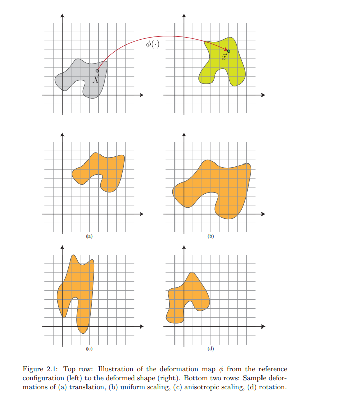
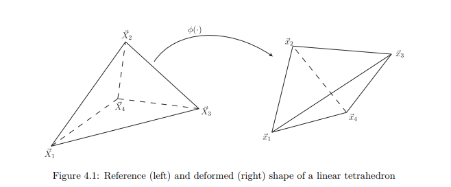
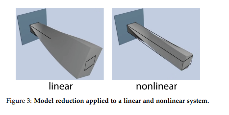

# Simulation of Continuum Elastic Materials

## Overview

Continuum elastic materials are modeled in computational mechanics to predict their behavior under various conditions. This document focuses on hyperelastic materials, which can undergo large deformations while returning to their original shape when unloaded.

## Hyper-Elastic Material Models

### Deformation Map and Gradient

The deformation of an elastic body is described by a deformation function φ(X), which maps material points X in the reference configuration to their deformed positions x. The deformation gradient tensor F is defined as the Jacobian matrix of this map.

### Strain Energy and Hyperelasticity

Hyperelastic materials are characterized by a strain energy density function Ψ(F), which depends only on the final deformed shape, not the deformation path. The total strain energy E[φ] is obtained by integrating Ψ over the entire domain.

### Force and Traction

The elastic forces in a deformed body are derived from the strain energy. For hyperelastic materials, these forces are conservative, meaning the work done is path-independent.

### Material Models

While the notes don't explicitly mention the Saint-Venant Kirchhoff or Stable Neo-Hookean models, they discuss the general form of strain energy density functions for hyperelastic materials. Specific material models are addressed in later chapters of the notes.

### Saint-Venant Kirchhoff Model

The Saint-Venant Kirchhoff model is one of the simplest hyper-elastic material models. It is a straightforward extension of linear elasticity to large deformations. The model is defined using the following strain energy density function:

\[ W = \frac{1}{2} \lambda (\text{tr}(E))^2 + \mu \text{tr}(E^2) \]

where:
- \( E \) is the Green-Lagrange strain tensor.
- \( \lambda \) and \( \mu \) are the Lame coefficients.

The Saint-Venant Kirchhoff model is suitable for small to moderate deformations but may not be accurate for very large deformations as it does not account for the material's stiffening behavior at large strains.

### Stable Neo-Hookean Model

The Stable Neo-Hookean model is a more robust hyper-elastic material model that can handle larger deformations more accurately. It is defined using the following strain energy density function:

\[ W = \frac{\mu}{2} (\text{I}_1 - 3) - \mu \ln(J) + \frac{\lambda}{2} (\ln(J))^2 \]

where:
- \( \text{I}_1 \) is the first invariant of the Cauchy-Green deformation tensor.
- \( J \) is the determinant of the deformation gradient tensor \( F \).
- \( \lambda \) and \( \mu \) are the Lame coefficients.

The Stable Neo-Hookean model includes a logarithmic term that accounts for the volumetric changes, making it stable and accurate for large deformations.

### Hyper-Elastic Beam Simulation

Linear (left) and quadratic (right) shape functions are compared in a hyper-elastic simulation of a beam. The left side of the beam is fixed, and quadratic shape functions result in smoother and softer bending.

  
   

### Modal Analysis

The hyper-elastic beam's representative deformation modes, i.e., its low-frequency eigenvectors, are animated as time continuous signals.

    

## Conclusion

The Physics Based Animation Toolkit (PBAT) provides a robust framework for simulating continuum elastic materials, with efficient implementations of hyper-elastic material models like Saint-Venant Kirchhoff and Stable Neo-Hookean. These tools enable accurate simulations of large deformations in a variety of materials, facilitating advanced research and development in computational mechanics.

Explore the full capabilities of PBAT by diving into its [documentation](http://www.femdefo.org/).